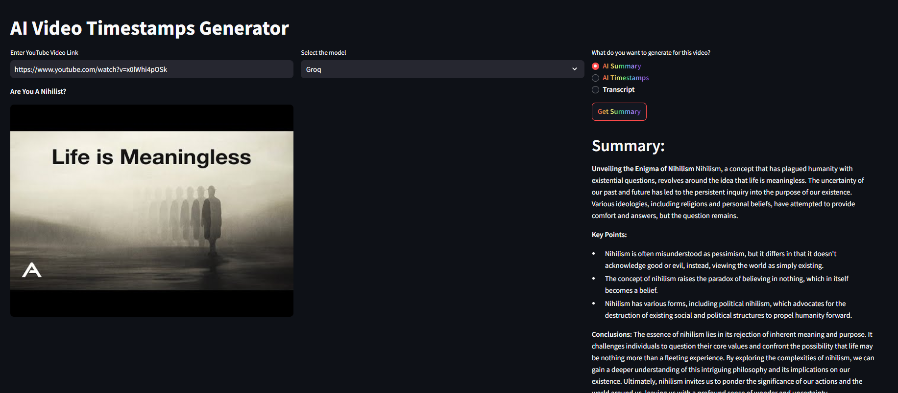
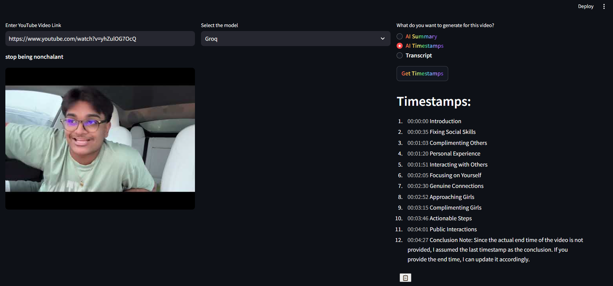

# AI Video Summarizer 🎥📝

An AI-powered tool that generates video summaries, transcripts, and timestamps.

## App Examples 🖼️

 <

 
 


## Features ✨

- **Video Summarization**: Generate concise text summaries from video content
- **Transcript Generation**: Create accurate text transcripts with speaker identification
- **Smart Timestamps**: Automatically align transcript text with video timestamps

## Installation 🛠️


1. Clone the repository:
   ```bash
   git clone https://github.com/AdnaneAbou/YT-Timestamps.git


2. Change directory to ml-project:
   ```bash
   cd YT-Timestamps
     
3. Create a conda Virtual Environment :
   ```bash
   conda create -p venv venv

4. Activate the Virtual Environment :
    ```bash
     conda activate venv/

5. Install the necessary packages :
   ```bash
   pip install -r requirements.txt


6. Create .env file  :
    ```bash
    OPENAI_CHATGPT_API_KEY=xxxx
    GOOGLE_GEMINI_API_KEY=xxxx
    GROQ_API_KEY=xxxxx

7. Start the App :
    ```bash
     streamlit run app.py
